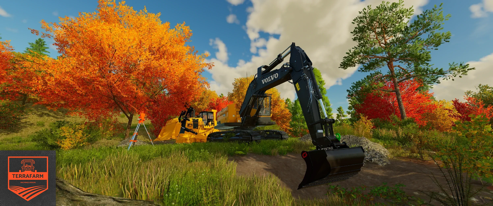

# TerraFarm - Machines Addon - Monk's Additions

Monk's Added Machines

WIP Fork of main mod [Terrafarm Machines](https://github.com/scfmod/FS25_TerraFarmMachines) 

All credit to the orignal creator.

This mod adds support for 3rd. party equipment.

Feel free to use this as base for your own configuration mod.

**Requires [TerraFarm](https://github.com/scfmod/FS25_TerraFarm) 0.9.0.0 or later installed**

## How to download and install


## List of supported equipment

### Modhub

```
Excavator Attachments
Excavator Tool Pack
Fiat-Allis Ad9
JCB 714
JCB Backhoe Loader
JCB Hydradig 110W
Volvo Pack - DR631
Volvo Pack - LM841 Rock Shovel
Volvo Pack - LM841 Shovel
```

### Other

```
ACM Cat D11 NG
Case CX35B
Doosan DX225LC
D6T2
D6T2U
JD135C
JohnDeere 650K
Gjerstad Pack
T-130
FSM Komatsu 575D
FSM CAT 6015B
```

Read the full mod list [here](./MODS.md).

